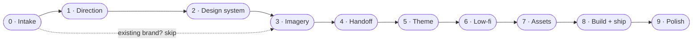

<div align="center">

```
 _      _   _       _           _ _     _
| |    | | ( )     | |         (_) |   | |
| | ___| |_|/ ___  | |__  _   _ _| | __| |
| |/ _ \ __| / __| | '_ \| | | | | |/ _` |
| |  __/ |_  \__ \ | |_) | |_| | | | (_| |
|_|\___|\__| |___/ |_.__/ \__,_|_|_|\__,_|
      s o m e t h i n g   p r e t t y
```

### A Claude Code plugin that designs websites people actually want to show off.

**Research. Design system. Imagery. A real concept. Low-fi. Assets. Build. Ship.**<br>
**One signed-off step at a time. Never one-shot.**


`/prettifysite:start`

</div>

---

## The problem

You ask an AI for "a stunning landing page". Ninety seconds later you get one.

Hero. Three feature cards. Testimonials. A gradient. A CTA. It is fine.
It is also the same site everyone else got, and you rate it a generous **2/10**.

Great sites are not generated. They are **decided**: hundreds of small choices,
each one looked at, argued about and signed off. This plugin makes Claude work
like a design partner who runs that process with you, from the first moodboard
to the last Lighthouse run.

```
  ┌─────────────────────────┐          ┌─────────────────────────┐
  │  one-shot               │          │  let's build something  │
  │                         │          │  pretty                 │
  │  "make it pop" ──► site │          │                         │
  │                         │   vs.    │  brief ─► research ─►   │
  │  2/10                   │          │  system ─► imagery ─►   │
  │  looks like a template  │          │  theme ─► low-fi ─►     │
  │  nobody shows it off    │          │  assets ─► build ─► 🚀  │
  └─────────────────────────┘          └─────────────────────────┘
```

---

## Install

```text
/plugin marketplace add patheonsceo/lets-build-something-pretty
/plugin install prettifysite@lets-build-something-pretty
```

Then, in any project folder:

```text
/prettifysite:start a site for my architecture studio
```

Already started? `/prettifysite:start continue` picks up exactly where you left off,
even in a brand-new session. Lost track? `/prettifysite:status`:

```
  prettifysite · Crumb & Co
  ███████████░░░░░░░░░  5/9 gates signed off

  ✓  00  Intake          signed off
  ✓  01  Direction       signed off
  ✓  02  Design system   signed off
  ✓  03  Imagery         signed off
  ✓  04  Handoff         signed off
  ▶  05  Theme           in progress · theme options
  ·  06  Low-fi design
  ·  07  Assets
  ·  08  Build + ship

  Decisions  12 approved · 3 delegated · 5 rejected
  Missing    Photos · Phone
```

---

## The journey



| # | Phase | What happens | You sign off |
|---|---|---|---|
| 0 | **Intake** | Who it's for, what "success" means, what assets exist and what's missing. Prerequisites checked. | The brief |
| 1 | **Direction** | You bring inspiration. Claude researches Awwwards, Godly, Dribbble, Pinterest and your competitors *in a real browser*, then pitches 2-4 directions. | One direction |
| 2 | **Design system** | Colour, type, scale, grid, buttons with every state, glass, header, cursor, text-on-photo, motion. **One at a time.** | Each element, then a clean canvas |
| 3 | **Imagery** | Art direction, 2-3 demo images, and how to generate: your own subscription via browser automation, or an API. | The vibe + the method |
| 4 | **Handoff** | Everything decided goes into a committed spec. Safe to take a break. | The spec |
| 5 | **Theme** | The big one. 3+ site-wide concepts: a through-line, how sections flow, motion language, cinematic hero moments. | One theme |
| 6 | **Low-fi** | Every section laid out in grey boxes with real copy and motion captions, then a critique pass. | Each section + the shot list |
| 7 | **Assets** | Images and video generated from the frozen shot list, watermarks patched, graded, aligned, cut into scroll frames. | Every asset |
| 8 | **Build + ship** | Theme layers first, then section by section. Tested on a production build at 1440 / 768 / 390, reduced motion, LCP and CLS. | QA pass, then "ship it" |
| 9 | **Polish** | Post-launch changes with the same care, smaller scale. | Each change |

---

## The rules it plays by

1. **Never one-shot.** One decision at a time.
2. **You sign off, every time.** Claude may push back once. You decide.
3. **"I trust you" compresses the gates, it never removes them.** Claude picks, then shows you everything once for a single yes.
4. **See, don't guess.** References are opened and screenshotted, never imagined.
5. **Both sides bring inspiration.**
6. **Everything is written down.** Every approval, every rejection and *why*, in `.pretty/`.
7. **No flat sections.** Every site gets a concept, motion and at least one moment people remember.
8. **Fast or it doesn't ship.** LCP < 1.5s, CLS 0, 60fps, zero console errors.
9. **Reduced motion is a first-class citizen.** Every pinned scene has a way through.
10. **No made-up facts.** Placeholders and proposed copy are flagged, never passed off as real.

---

## Gates with teeth

The rules aren't just words in a prompt. A built-in hook watches every file
write: if Claude tries to write site code while your project is still in
design, **you** get a confirmation prompt with the reason, and you decide.
Design files (`.pretty/`, docs, boards) are never blocked, and projects that
don't use the plugin are never touched.

## No copy? No problem

Clients rarely have copy ready. `writing-the-copy` finds the brand voice
first (the same paragraph in three voices, you pick), then drafts 2-3
headline options per section alongside each low-fi board. Facts come only
from you; anything unconfirmed stays a visible placeholder like `[N]+ clients`.

---

## How the questions feel

No walls of text. Every decision is a click, with a recommendation on top:

```
┌ Type ─────────────────────────────────────────────────────────┐
│ Which pairing carries the brand?                              │
│                                                               │
│ ❯ Pairing 4 · Regular (Recommended)                           │
│     Clean grotesk + a serif for 1-3 italic words. Calm, sure. │
│   Pairing 2 · Medium                                          │
│     More editorial, heavier numerals.                         │
│   Pairing 7 · Warm modern                                     │
│     Friendlier, less institutional.                           │
│   Other…                                                      │
└───────────────────────────────────────────────────────────────┘
```

Visual choices come with side-by-side previews, and the canvas shows the real thing.

---

## What's in the box

```
skills/        start · status · writing-the-copy · one skill per phase (loaded only when needed)
hooks/         the gate guard (asks you before site code is written too early)
evals/         behaviour tests: one-shot pressure, delegation, theme, cold resume
references/    gates.md · lessons.md · stack-recommended.md · canvas.md
templates/     brief · assets · decisions · shot list · spec · state
scripts/
  check-prereqs.sh            is everything installed and up to date?
  gen/                        Gemini image + Veo video via a real browser (you sign in)
  img/                        watermark patch · house grade · baseline align · contact sheets
  video/                      clean + grade + reverse · scroll frame sequences
  qa/                         section screenshots · LCP / CLS / overflow / reduced-motion audit
```

`lessons.md` is the good stuff: every rule in it exists because breaking it
once cost a rebuild. Serif descenders clipped by reveal masks. Pinned scenes
unreachable with reduced motion. 720p video looking soft full-screen. AI
sparkle watermarks hiding in "client" photos. A package manager quietly
rewriting the wrong lockfile. You get the fixes without the pain.

---

## Tested, not just written

Every rule is checked with Claude Code's plugin evals: the same prompts run
**with** and **without** the plugin, graded by judges.

| Scenario | Without plugin | With plugin |
|---|:---:|:---:|
| "Go all out, I trust you, I'm busy" (does it one-shot?) | 0.00 | **1.00** |
| "You pick everything, just build it" (does it skip the gate?) | 0.20 | **1.00** |
| "Plan the sections and the feel" (3+ real themes, not a template?) | 0.00 | **1.00** |
| New session: "continue where we left off" | 1.00 | **1.00** |

Run them yourself from the repo root:

```bash
claude plugin eval . --scaffold --allow-tools Bash Write Edit WebSearch
```

---

## Prerequisites

| | |
|---|---|
| **Required** | [Claude Code](https://claude.com/claude-code) · [gstack](https://github.com/garrytan/gstack) (the browser Claude uses to research and QA) · Node 20+ · pnpm · git · ImageMagick 7 · ffmpeg |
| **Recommended** | [superpowers](https://github.com/obra/superpowers) · impeccable · frontend-design |
| **For imagery** | A Gemini (Google AI Pro) subscription for browser-automated generation, *or* credits with any image/video API |

`/prettifysite:start` checks all of this first. Missing gstack? It shows you
the install line. Old gstack? It asks you to run `/gstack-upgrade` before
anything else.

**The recommended stack** (the one the author mostly uses, and the default the
plugin offers): Next.js · TypeScript · Tailwind v4 · GSAP + ScrollTrigger ·
Lenis · OGL · Vercel. Prefer something else? Say so at intake; the process
doesn't care.

---

## FAQ

**Is it slow?**
It is deliberate. A full site is a few long sessions, not ninety seconds.
That is the point. You can always say "you pick" and review in batches.

**Landing pages only?**
Landing pages and multi-page sites.

**We already have a brand system.**
Say so at intake and skip straight past direction and design system.

**Can I stop halfway?**
Yes. Close the laptop. `/prettifysite:start continue` next week.

**Does it write the copy?**
It uses yours. Anything it proposes is marked *proposed* until you approve it.

---

<div align="center">

**Stop shipping 2/10s.**

`/prettifysite:start`

MIT © [patheonsceo](https://github.com/patheonsceo)

</div>
